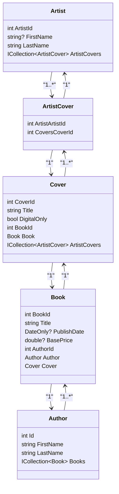

<h1>Klasser</h1>

## UML Klassediagram

# Use Case 1: Log ind

## Use Case-navn
**Bruger logger ind**

## Primær aktør
**Admin-bruger**

## Interessenter og mål
- **Admin-bruger**: Ønsker at få adgang til administration-panelet for at redigere bøger og administrere brugere.

## Forudsætninger
- Admin-brugeren er allerede oprettet i systemet med et GUID, krypteret og hashet adgangskode.

## Efterfølgende tilstand
- Bruger modtager en JWT-token (og evt. refresh token) og får adgang til administrationssiden.

## Hovedforløb
1. Bruger navigerer til “Admin” linket på siden.
2. Bruger indtaster brugernavn og adgangskode.
3. Angular sender loginoplysninger til backend API.
   - 3a. **Bruger indtaster forkert brugernavn eller adgangskode**:
     - API returnerer fejlkode og fejlmeddelelse til Angular.
     - Angular viser “Fejl ved login: Ugyldigt login”.
4. Backend validerer brugernavn og hasher den indtastede adgangskode og sammenligner med databasen.
5. Hvis oplysningerne er korrekte:
   - API genererer JWT-token.
6. Bruger får mulighed for at oprette og redigere bog-data.

---

# Use Case 2: Opret ny bruger

## Use Case-navn
**Admin opretter ny bruger**

## Primær aktør
**Admin-bruger**

## Interessenter og mål
- **Admin**: Vil kunne tilføje nye brugere, som kan logge ind og redigere indhold.

## Forudsætninger
- Admin-bruger er logget ind.
- Administration er tilgængelig i navbar.

## Efterfølgende tilstand
- En ny bruger er oprettet i databasen med GUID, hashet adgangskode og evt. tildelte rettigheder.

## Hovedforløb
1. Admin vælger “Ny bruger” i admin-navbar.
2. Admin udfylder formular med:
   - Brugernavn
   - Adgangskode
   - 2a. **Admin glemmer at udfylde et felt**:
     - Angular viser valideringsfejl: ”Fejl ved registrering: undefined”
3. Angular sender data til backend API.
4. API:
   - Validerer input
   - Genererer unikt GUID til brugeren
   - Hasher adgangskoden med bcrypt
   - Gemmer brugeren i databasen
   - 4a. **Brugernavn findes allerede i databasen**:
     - API returnerer fejl
     - Angular viser “Fejl ved registrering: Brugernavn er allerede taget.”
5. API returnerer bekræftelse til Angular.
6. Admin ser besked ”Bruger registreret!”

---

## Udvidelse
Jeg kunne godt udvide sikkerheden med timestamps og logging af de forskellige handlinger, såsom login og oprettelse.

