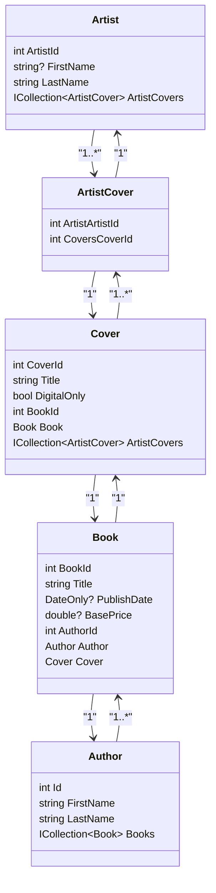

<h1>Klasser</h1>

## UML Klassediagram


# Domænemodel for Bogforlagsprojekt

Denne domænemodel beskriver de vigtigste forretningsobjekter (entiteter) og deres relationer i systemet.

---

## Entiteter

### Artist
- **Beskrivelse:** En kunstner, der bidrager til bogomslag.
- **Attributter:**
  - `ArtistId` (int)
  - `FirstName` (string, nullable)
  - `LastName` (string)
- **Relationer:**
  - Har mange `ArtistCover` (mange-til-mange relation til `Cover` via join-entity)

---

### Author
- **Beskrivelse:** En forfatter, der skriver bøger.
- **Attributter:**
  - `Id` (int)
  - `FirstName` (string)
  - `LastName` (string)
- **Relationer:**
  - Har mange `Books`

---

### Book
- **Beskrivelse:** En bog skrevet af en forfatter og har ét omslag.
- **Attributter:**
  - `BookId` (int)
  - `Title` (string)
  - `PublishDate` (DateOnly?, nullable)
  - `BasePrice` (double?, nullable)
  - `AuthorId` (int)
- **Relationer:**
  - Har én `Author`
  - Har ét `Cover`

---

### Cover
- **Beskrivelse:** Bogomslag, som kan være digitalt eller fysisk.
- **Attributter:**
  - `CoverId` (int)
  - `Title` (string)
  - `DigitalOnly` (bool)
  - `BookId` (int)
- **Relationer:**
  - Hører til én `Book`
  - Har mange `ArtistCover` (mange-til-mange relation til `Artist`)

---

### ArtistCover
- **Beskrivelse:** Join-entity der repræsenterer mange-til-mange relation mellem `Artist` og `Cover`.
- **Attributter:**
  - `ArtistArtistId` (int)
  - `CoversCoverId` (int)
- **Relationer:**
  - Hører til én `Artist`
  - Hører til ét `Cover`

---

### User
- **Beskrivelse:** En bruger i systemet (fx admin), som kan logge ind.
- **Attributter:**
  - `Id` (Guid)
  - `UserName` (string)
  - `Password` (string, hashed)
- **Relationer:**
  - Ingen direkte relation til bogdata (bruges til autentificering)

---

## Relationer mellem entiteter

- En **Author** kan have mange **Books** (1:N).
- En **Book** har præcis én **Author** (N:1).
- En **Book** har ét **Cover** (1:1).
- Et **Cover** hører til én **Book** (1:1).
- Et **Cover** kan have mange **Artists** via **ArtistCover** (mange-til-mange).
- En **Artist** kan bidrage til mange **Covers** via **ArtistCover** (mange-til-mange).
- **ArtistCover** forbinder mange-til-mange relationen mellem `Artist` og `Cover`.

---

## Overordnet model

```text
Author ---< Book >--- Cover ---< ArtistCover >--- Artist
                           ^
                          has
                        User (admin/login)

```


# Use Case 1: Log ind

## Use Case-navn
**Bruger logger ind**

## Primær aktør
**Admin-bruger**

## Interessenter og mål
- **Admin-bruger**: Ønsker at få adgang til administration-panelet for at redigere bøger og administrere brugere.

## Forudsætninger
- Admin-brugeren er allerede oprettet i systemet med et GUID, krypteret og hashet adgangskode.

## Efterfølgende tilstand
- Bruger modtager en JWT-token (og evt. refresh token) og får adgang til administrationssiden.

## Hovedforløb
1. Bruger navigerer til “Admin” linket på siden.
2. Bruger indtaster brugernavn og adgangskode.
3. Angular sender loginoplysninger til backend API.
   - 3a. **Bruger indtaster forkert brugernavn eller adgangskode**:
     - API returnerer fejlkode og fejlmeddelelse til Angular.
     - Angular viser “Fejl ved login: Ugyldigt login”.
4. Backend validerer brugernavn og hasher den indtastede adgangskode og sammenligner med databasen.
5. Hvis oplysningerne er korrekte:
   - API genererer JWT-token.
6. Bruger får mulighed for at oprette og redigere bog-data.

---

# Use Case 2: Opret ny bruger

## Use Case-navn
**Admin opretter ny bruger**

## Primær aktør
**Admin-bruger**

## Interessenter og mål
- **Admin**: Vil kunne tilføje nye brugere, som kan logge ind og redigere indhold.

## Forudsætninger
- Admin-bruger er logget ind.
- Administration er tilgængelig i navbar.

## Efterfølgende tilstand
- En ny bruger er oprettet i databasen med GUID, hashet adgangskode og evt. tildelte rettigheder.

## Hovedforløb
1. Admin vælger “Ny bruger” i admin-navbar.
2. Admin udfylder formular med:
   - Brugernavn
   - Adgangskode
   - 2a. **Admin glemmer at udfylde et felt**:
     - Angular viser valideringsfejl: ”Fejl ved registrering: undefined”
3. Angular sender data til backend API.
4. API:
   - Validerer input
   - Genererer unikt GUID til brugeren
   - Hasher adgangskoden med bcrypt
   - Gemmer brugeren i databasen
   - 4a. **Brugernavn findes allerede i databasen**:
     - API returnerer fejl
     - Angular viser “Fejl ved registrering: Brugernavn er allerede taget.”
5. API returnerer bekræftelse til Angular.
6. Admin ser besked ”Bruger registreret!”
 
---

## Udvidelse
Jeg kunne godt udvide sikkerheden med timestamps og logging af de forskellige handlinger, såsom login og oprettelse.

---
## DDD

| Klasse                     | Type                             | Begrundelse                                                                                                   |
| -------------------------- | -------------------------------- | ------------------------------------------------------------------------------------------------------------- |
| **Author**                 | Entity + Aggregate Root          | Har ID og ejer bøger (1\:N). `Author` er adgangsvej til `Books`.                                              |
| **Book**                   | Entity + Evt. egen Aggregate     | Har identitet (`BookId`) og egne regler og relation til `Author`, `Cover`. Kan stå som selvstændig aggregate. |
| **Cover**                  | Entity                           | Har ID og relation til både `Book` (1:1) og `Artists` (M\:N). Ejer relationen til `ArtistCover`.              |
| **Artist**                 | Entity                           | Har identitet (`ArtistId`) og kan deltage i mange omslag.                                                     |
| **ArtistCover**            | Entity (join-entity)             | Ingen egen betydning som aggregate, men identificerbar og del af `Cover`-aggregate.                           |
| **User**                   | Entity + Aggregate Root          | Har GUID ID og ansvar for login/autentificering. Oprettes og behandles isoleret.                              |
| *FullName*                 | Value Object                     | Hvis fx `FullName` som klasse i stedet for separate felter.                                                   |


