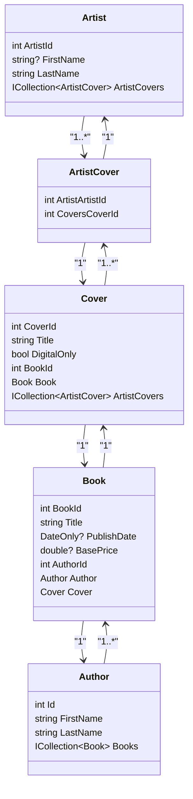

<h1>Klasser</h1>

## UML Klassediagram

## 🧑‍🎨 Artist

| Felt           | Type                       |
| -------------- | -------------------------- |
| `ArtistId`     | `int`                      |
| `FirstName`    | `string` *(valgfri)*       |
| `LastName`     | `string` *(valgfri)*       |
| `ArtistCovers` | `ICollection<ArtistCover>` |

## 🎨 ArtistCover (Join-tabel)

| Felt             | Type  |
| ---------------- | ----- |
| `ArtistArtistId` | `int` |
| `CoversCoverId`  | `int` |

Relationer:

Mange-til-mange mellem Artist og Cover

Hver post forbinder én Artist med ét Cover

## ✍️ Author

| Felt        | Type                |
| ----------- | ------------------- |
| `Id`        | `int`               |
| `FirstName` | `string`            |
| `LastName`  | `string`            |
| `Books`     | `ICollection<Book>` |

## 📖 Book

| Felt          | Type                    |
| ------------- | ----------------------- |
| `BookId`      | `int`                   |
| `Title`       | `string`                |
| `PublishDate` | `DateOnly`              |
| `BasePrice`   | `double`                |
| `AuthorId`    | `int`                   |
| `Author`      | `Author`                |
| `Cover`       | `Cover`                 |

Relationer:

En Book har præcis én Author (1 → mange)

En Book har præcis ét Cover

## 🧾 Cover

| Felt           | Type                       |
| -------------- | -------------------------- |
| `CoverId`      | `int`                      |
| `Title`        | `string` *(valgfri)*       |
| `DigitalOnly`  | `bool`                     |
| `BookId`       | `int`                      |
| `Book`         | `Book`                     |
| `ArtistCovers` | `ICollection<ArtistCover>` |

# Noter
Der kan tilføjes et felt med rabat

   

# APP

## Bog – Indsæt ny

### Påkrævede felter
- **Titel**  
- **Publiceringsdato**  
- **Basispris**  
- **ForfatterFornavn**  
- **ForfatterEfternavn**
- **CoverDigital?** *(true/false)*  

### Valgfrie felter
- **CoverTitel**  
- **CoverKunstnerFornavn**  
- **CoverKunstnerEfternavn**

## Liste af alle bøger

## Søgning og liste på titel eller fornavn eller årstal

